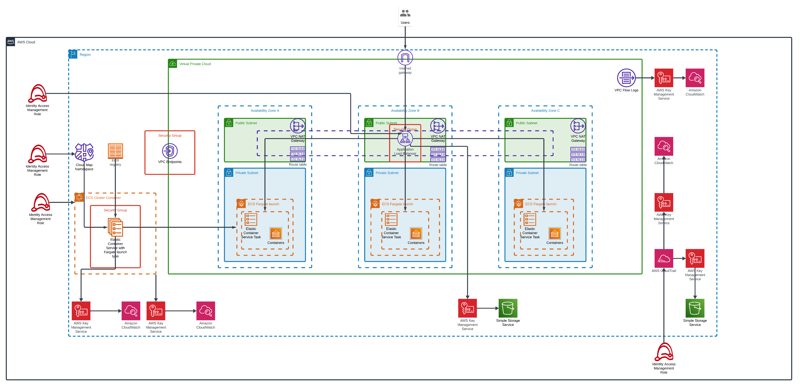

# aws-ecs-fargate-container-platforms

## Description
Terraform for creating an AWS ECS fargate container platform



## Key infrastructure

| Name | Description |
|------|------|
| [ecs-service-fargate](https://github.com/terraform-aws-modules/terraform-aws-ecs.git) | ECS fargate service where workloads are orchestrated and defined |


## Pre-requisite
1. Get relevant AWS credentials (Access Key and Access Secret) to apply terraform locally or input credentials into the relevant Pipeline variables
2. Create S3 bucket and configure as Terraform remote backend to store the relevant Terraform statefile

## Usage
```sh
terraform init
terraform fmt
terraform valiate
terraform plan -out=$PLAN
terraform apply -input=false --auto-approve $PLAN
terraform plan -destroy -out=$DESTROY
terraform apply -input=false --auto-approve $DESTROY
```